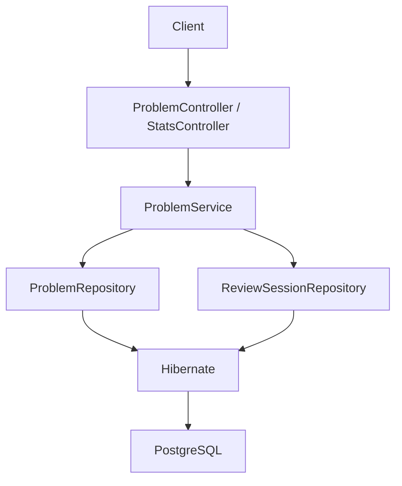

# LeetCode Review System

A Spring Boot REST backend for tracking LeetCode problems and scheduling spaced-repetition reviews. It persists problems and review history in PostgreSQL and exposes APIs for CRUD, due-review queues, filtering, and learning statistics.

## Features

- Problem CRUD over HTTP
- Persistent storage in PostgreSQL via Spring Data JPA / Hibernate
- Spaced-repetition scheduling on each completed review
- Due-review queue (`nextReviewDate <= today`), ordered most overdue first
- Optional filtering by `difficulty`, `pattern`, and `solved` (including combinations)
- Persistent review history (`ReviewSession` per completed review)
- Aggregate stats: totals, due count, total reviews, difficulty and pattern breakdowns
- Jakarta Bean Validation on create/update request bodies
- Centralized JSON error handling for validation failures and missing resources

## Tech Stack

Verified from `pom.xml` (Spring Boot parent **4.1.1**):

| Layer | Technology |
| --- | --- |
| Language | Java 21 |
| Framework | Spring Boot 4.1.1 |
| HTTP | `spring-boot-starter-webmvc` |
| Persistence | `spring-boot-starter-data-jpa` (Hibernate as JPA provider) |
| Validation | `spring-boot-starter-validation` |
| Database | PostgreSQL (`postgresql` JDBC driver, runtime) |
| Build | Maven Wrapper (`./mvnw`) |
| Tests | `spring-boot-starter-webmvc-test` (JUnit 5, Mockito, MockMvc) |

No authentication, frontend, or message broker is included.

## Architecture

```text
Client
  ↓
REST Controller
  ↓
Service / Business Logic
  ↓
Repository
  ↓
JPA / Hibernate
  ↓
PostgreSQL
```



| Layer | Responsibility |
| --- | --- |
| Controllers | Map HTTP routes, bind query/body parameters, apply `@Valid`, return HTTP status codes |
| `ProblemService` | Orchestrate use cases: CRUD, filters, due queue, review + history, stats. Class-level `@Transactional` |
| Repositories | Persistence and query methods only (derived queries and JPQL) |
| JPA / Hibernate | Entity mapping; `spring.jpa.hibernate.ddl-auto=update` updates schema on startup |
| PostgreSQL | Source of truth for `problems` and `review_sessions` |

### Domain model

```text
Problem  1 ──────<  ReviewSession
```

- **Problem** holds current review state: `timesReviewed`, `lastReviewed`, `nextReviewDate`, plus catalog fields (`title`, `difficulty`, `pattern`, `notes`, `solved`).
- **ReviewSession** is a historical event: `reviewedAt`, the `nextReviewDate` computed for that review, and a many-to-one link to `Problem`. JSON exposes `problemId` and does not serialize the nested `Problem` graph.

`POST /problems/{id}/review` updates the problem and inserts a `ReviewSession` in the same transaction so both succeed or both roll back. Deleting a problem cascades to its sessions (`ON DELETE CASCADE`).

## Review Scheduling

`Problem.markReviewed()` increments `timesReviewed`, sets `lastReviewed` to `LocalDate.now()`, and sets `nextReviewDate` from the new review count:

| Review # | Interval |
| --- | --- |
| 1 | +1 day |
| 2 | +3 days |
| 3 | +7 days |
| 4 | +14 days |
| 5+ | +30 days |

A problem is **due** when `nextReviewDate <= LocalDate.now()`. `GET /problems/due` returns those rows ordered by `nextReviewDate` ascending (oldest / most overdue first). Filtering and ordering run in the database.

## API

Default local URL: `http://localhost:8080` (no custom `server.port` is set).

| Method | Path | Description |
| --- | --- | --- |
| `GET` | `/hello` | Liveness-style JSON: `{ "message", "status" }` |
| `POST` | `/problems` | Create a problem |
| `GET` | `/problems` | List problems; optional filters |
| `GET` | `/problems/{id}` | Get one problem |
| `PUT` | `/problems/{id}` | Replace mutable fields from the request body |
| `DELETE` | `/problems/{id}` | Delete; **204 No Content** on success |
| `POST` | `/problems/{id}/review` | Apply scheduling and persist a `ReviewSession` |
| `GET` | `/problems/{id}/reviews` | Review history, `reviewedAt` then `id` ascending |
| `GET` | `/problems/due` | Due problems, oldest `nextReviewDate` first |
| `GET` | `/stats` | Aggregate statistics |

`GET /problems` query parameters (all optional; omitted parameters are not applied):

| Parameter | Type | Notes |
| --- | --- | --- |
| `difficulty` | string | Exact match (`Easy`, `Medium`, or `Hard`) |
| `pattern` | string | Exact match (URL-encode spaces, e.g. `Two%20Pointers`) |
| `solved` | boolean | `true` / `false` |

### Problem JSON

Serialized fields: `id`, `title`, `difficulty`, `pattern`, `notes`, `timesReviewed`, `solved`, `lastReviewed`, `nextReviewDate`. Dates are ISO-8601 (`YYYY-MM-DD`). `solved` is a primitive `boolean` and should be sent explicitly on write.

### ReviewSession JSON

Serialized fields: `id`, `problemId`, `reviewedAt`, `nextReviewDate`. `reviewedAt` is a timestamp (`LocalDateTime`).

### Stats JSON

`totalProblems`, `solvedProblems`, `dueProblems`, `totalReviews` (sum of `timesReviewed`), `difficultyBreakdown` (always includes `Easy` / `Medium` / `Hard`), `patternBreakdown` (patterns that exist).

### Examples

**Create a problem**

```bash
curl -s -X POST http://localhost:8080/problems \
  -H "Content-Type: application/json" \
  -d '{
    "title": "Two Sum",
    "difficulty": "Easy",
    "pattern": "HashMap",
    "notes": "Complement lookup",
    "timesReviewed": 0,
    "solved": true
  }'
```

Example response:

```json
{
  "id": 1,
  "title": "Two Sum",
  "difficulty": "Easy",
  "pattern": "HashMap",
  "notes": "Complement lookup",
  "timesReviewed": 0,
  "solved": true,
  "lastReviewed": null,
  "nextReviewDate": null
}
```

**Filter problems**

```bash
curl -s "http://localhost:8080/problems?difficulty=Medium&solved=true"
curl -s "http://localhost:8080/problems?pattern=Two%20Pointers"
```

**Mark a problem reviewed**

```bash
curl -s -X POST http://localhost:8080/problems/1/review
```

The problem’s `timesReviewed`, `lastReviewed`, and `nextReviewDate` are updated. A matching history row is stored (then listed via `GET /problems/1/reviews`).

**Due reviews**

```bash
curl -s http://localhost:8080/problems/due
```

**Statistics**

```bash
curl -s http://localhost:8080/stats
```

Example shape:

```json
{
  "totalProblems": 100,
  "solvedProblems": 70,
  "dueProblems": 12,
  "totalReviews": 250,
  "difficultyBreakdown": {
    "Easy": 20,
    "Medium": 50,
    "Hard": 30
  },
  "patternBreakdown": {
    "Arrays": 20,
    "Two Pointers": 15
  }
}
```

## Validation and Error Handling

`@Valid` is applied to `POST /problems` and `PUT /problems/{id}` bodies.

| Field | Rules |
| --- | --- |
| `title` | Must not be blank |
| `difficulty` | Must not be blank; must be `Easy`, `Medium`, or `Hard` |
| `pattern` | Must not be blank |
| `timesReviewed` | Must be ≥ 0 |

Invalid bodies return **400 Bad Request**:

```json
{
  "status": 400,
  "error": "Bad Request",
  "message": "title: title must not be blank; difficulty: difficulty must be Easy, Medium, or Hard"
}
```

(`message` concatenates field errors with `"; "`.)

Missing resources throw `ProblemNotFoundException` and return **404** for `GET /problems/{id}`, `PUT /problems/{id}`, `DELETE /problems/{id}`, `POST /problems/{id}/review`, and `GET /problems/{id}/reviews`:

```json
{
  "status": 404,
  "error": "Not Found",
  "message": "Problem not found: 999"
}
```

Handled in `@RestControllerAdvice` (`RestExceptionHandler`).

## Running Locally

**Prerequisites:** Java 21, PostgreSQL, Maven Wrapper (included).

1. Create a local database, for example:

   ```sql
   CREATE DATABASE leetcode_review;
   ```

2. Point the app at that database in `src/main/resources/application.properties`:

   - `spring.datasource.url` — JDBC URL
   - `spring.datasource.username` — database user
   - `spring.datasource.password` — if your PostgreSQL role requires a password, set it locally (do not commit secrets)

   Hibernate will create/update tables (`problems`, `review_sessions`) on startup (`ddl-auto=update`).

3. Start the API:

   ```bash
   ./mvnw spring-boot:run
   ```

4. Open `http://localhost:8080` (e.g. `GET /hello` or `GET /problems`).

## Testing

```bash
./mvnw test
```

The suite covers scheduling intervals, service behavior (filters, due-queue ordering, stats, review-session creation, history ordering), Bean Validation constraints, and HTTP 400/404 handling via MockMvc (`ProblemTest`, `ProblemValidationTest`, `ProblemServiceTest`, `ProblemControllerTest`, `StatsControllerTest`, plus a Spring context load test).

## Project Evolution

The first version was a Java CLI that stored data in CSV. The system was rebuilt as a layered Spring Boot REST service with PostgreSQL, transactional review history, query-backed filters/stats, and consistent HTTP validation/errors.

## Future Work

Not implemented:

- Natural-language LeetCode coaching and structured intent extraction from user messages
- Personalized study / review planning beyond the current interval table
- Optional client or frontend
